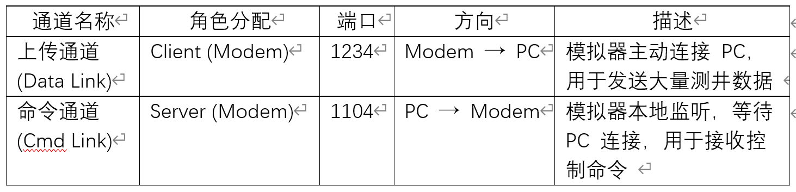
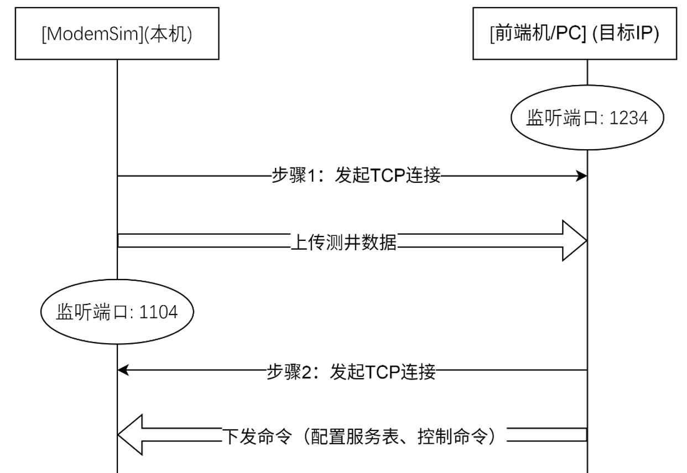
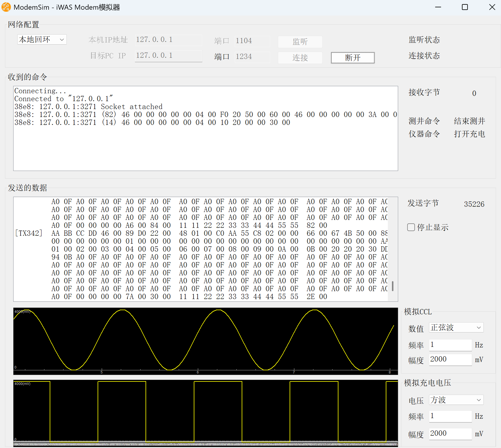
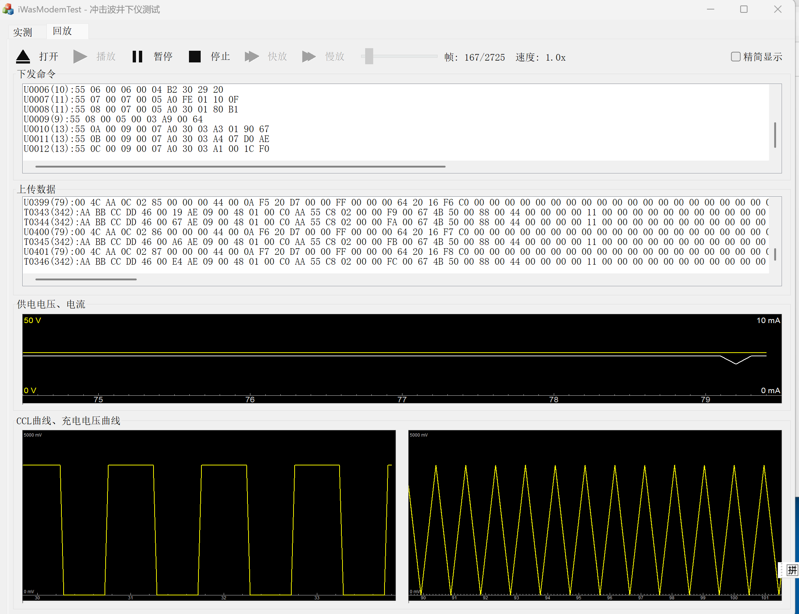

# ModemSim
冲击波井下仪用于射孔后压裂扩孔，此软件作为冲击波井下仪模拟器，协助上位机（前端机/PC）软件开发人员调试冲击波井下仪的双向通讯功能。  
该软件的TCP通讯参照了下列源码：http://www.flounder.com/kb192570.htm

## 项目概述 (Project Overview)
配接冲击波井下仪器时，因公司内部不具备硬件联调的条件，特开发此模拟器，不依赖硬件资源，缩短配接时间。  
该软件可运行在PC/Windows系统上，模拟真实井下数传短节的通讯协议，实现下发命令解析及测井数据上传。

## 系统架构与网络模型 (System Architecture)
本系统采用双通道非对称 TCP 通讯模型。为了完全仿真硬件行为，模拟器需同时扮演 TCP 客户端和 TCP 服务器的角色。
### 通讯通道定义

### 数据流向图

  

## 软件界面 (UI)
### ModemSim 主界面

  

### PC端测试程序

  

## 开发环境及技术栈
- **集成开发环境 (IDE)：** Microsoft Visual Studio 2010 (VC2010)
- **框架：** Microsoft Foundation Classes (MFC)
- **编程语言：** C++
- **SDK 版本：** Windows SDK v7.1 (VC2010 配套版本)
- **平台工具集：** v100 (对应 VS2010 的工具集)

